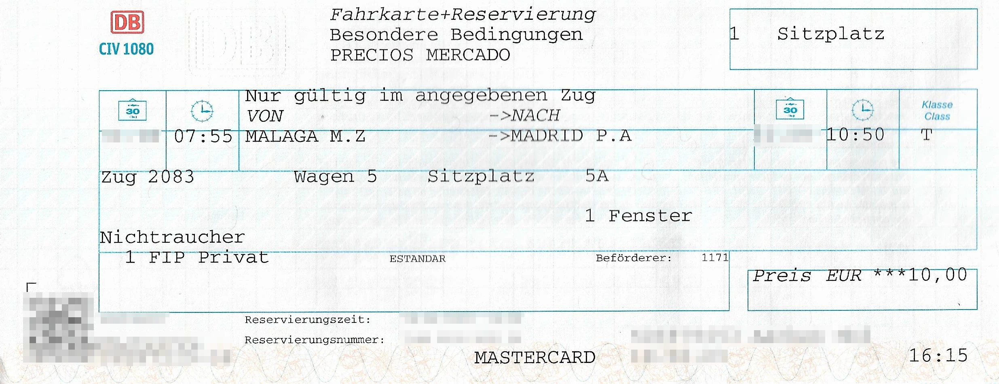

Renfe Operadora est la compagnie ferroviaire publique espagnole. Elle exploite des trains à grande vitesse confortables, divers trains régionaux et des trains de banlieue.

## Résumé

- Les billets FIP gratuits sont acceptés uniquement sur les trains de banlieue (Cercanías), pas sur les trains avec réservation obligatoire.
- Pour les trains avec réservation obligatoire, un billet au tarif FIP Global (indépendant de la distance) peut être acheté, incluant la réservation ; les coupons FIP ne sont pas nécessaires.
- Les billets FIP ne sont pas acceptés dans les trains Avlo.
- Pour les AVE internationaux entre Madrid et Marseille ou Lyon et Barcelone, les mêmes tarifs FIP Global s’appliquent que pour les AVE nationaux.

## Validité des billets FIP

- Coupon FIP : ✅ (sauf trains à réservation obligatoire)
- Coupon FIP accompagnant : ⛔
- Billet FIP 50 : ✅ (sauf trains à réservation obligatoire)
- Tarif FIP Global : ✅ pour les trains à réservation obligatoire (sauf Avlo)

## Train Categories and Reservations
{}
Only commuter trains can be used without restrictions with FIP Coupons. For other trains, a ticket at the FIP Global Fare usually needs to be purchased.
{}

### Long distance

{}
**Description:** \
Long-distance connections with high-speed trains (up to 300 km/h). FIP Coupons are not accepted.

International connections from / to France can be booked at the same conditions as domestic AVEs, although there is no premium category. Booking is only possible directly via Renfe, which is why tickets must be purchased at a ticket counter in Spain. It should be possible to buy tickets on the train when boarding in France, but there is no practical experience of this yet.

**Reservation possible:** yes \
**Reservation required:** ⚠️ yes \
**FIP Global Fare (regardless of distance):**
- 10€ (Elige Estándar)
- 13€ (Elige Confort)
- 23,50€ (Premium)
{}

{}
**Description:** \
Low-cost high-speed trains (up to 300 km/h). \
**Reservation possible:** yes \
**Reservation required:** ⚠️ yes \
**FIP:** ⛔ FIP is not accepted
{}

{}
**Description:** \
High-speed trains that can be re-gauged (Figueres <-> Alicante). FIP Coupons are not accepted. \
**Reservation possible:** yes \
**Reservation required:** ⚠️ yes \
**FIP Global Fare (regardless of distance):**
- 6,50€ (Elige Estándar)
- 10€ (Elige Confort)
- 23,50€ (Premium)
{}

{}
**Description:** \
High-speed trains that can be re-gauged (up to 250 km/h). FIP Coupons are not accepted. \
**Reservation possible:** yes \
**Reservation required:** ⚠️ yes \
**FIP Global Fare (regardless of distance):**
- 6,50€ (Elige Estándar)
- 10€ (Elige Confort)
{}

{}
**Description:** \
Passenger trains between regional and high-speed services (up to 250 km/h). FIP Coupons are not accepted. \
**Reservation possible:** yes \
**Reservation required:** ⚠️ yes \
**FIP Global Fare (regardless of distance):**
- 6,50€ (Elige Estándar)
- 10€ (Elige Confort)
{}

{}
**Description:** \
The Celta is an international cooperation train between Renfe and the Portuguese CP from Porto to Vigo. FIP Coupons are not accepted. \
**Reservation possible:** yes \
**Reservation required:** ⚠️ yes \
**FIP Global Fare (regardless of distance):** 4€
{}

### Moyenne distance

{}
**Description :** \
Trains à grande vitesse, durée de trajet < 90 minutes. Les coupons FIP gratuits ne sont pas acceptés. \
**Réservation possible :** oui \
**Réservation obligatoire :** ⚠️ oui \
**Tarif FIP Global (indépendant de la distance) :** 4€
{}

{}
**Description :** \
Trains régionaux accélérés. Les coupons FIP gratuits ne sont acceptés que sur les trains non soumis à réservation obligatoire de cette catégorie. Actuellement, cela ne concerne que la ligne Barcelone(-Girona-Figueres)-Port Bou. \
**Réservation possible :** oui \
**Réservation obligatoire :** ⚠️ oui (Exception : ligne Barcelone(-Girona-Figueres)-Port Bou[^1]) \
**Tarif FIP Global (indépendant de la distance) :** 4€
{}

### Trains de banlieue

{}
**Description :** \
Trains de banlieue, comparables à un RER/S-Bahn. Les coupons FIP gratuits sont valables sans restriction.
- Cercanías Asturias
- Cercanías Bilbao – Bilboko Aldiriak
- Cercanías Cádiz
- Cercanías Madrid
- Cercanías Málaga
- Cercanías Murcia/Alicante – Rodalia de Múrcia/Alacant
- Cercanías Sevilla
- Cercanías Santander
- Cercanías San Sebastián – Renfe Aldiriak/Donostia
- Cercanías Valencia – Rodalia de València
- Cercanías Zaragoza
- Rodalies de Catalunya

**Réservation possible :** non \
**Réservation obligatoire :** non
{}

## Catégories de classes

- **Elige Estándar / Turista** : équivalent à la 2de classe
- **Elige Confort** : siège XL en 1ʳᵉ classe sans service à bord – FIP 1ʳᵉ requis
- **Premium** : siège XL avec service + repas – FIP 1ʳᵉ requis (non réservable via DB)

## Achat de billets et réservations

### En ligne

Les billets FIP Global et FIP 50 ne peuvent pas être achetés en ligne.

### Par téléphone

Non disponible – il faut se rendre au guichet Renfe.

### En gare

{}
**Tarif FIP Global**

Dans les centres de services DB, il est possible d’acheter des billets pour les trains à réservation obligatoire. Il est important de sélectionner la classe « T » (pour Turista) ou « P » (pour Preferente). Si l’on choisit « 1re classe » ou « 2de classe », l’émission du billet échoue avec un message d’erreur. Il a également été signalé que la réservation en classe « P » échoue parfois ; dans ce cas, la réservation en classe « T » fonctionne généralement. Aucun frais de réservation n’est appliqué.

{}

{}

### À bord du train

Si aucun guichet n’est disponible, l’achat est possible à bord (à confirmer localement).

## Réductions

Les enfants de moins de 4 ans voyagent gratuitement sans siège propre. Pour les enfants de moins de 12 ans, une réduction de 40 % s’applique. À partir de 12 ans, le plein tarif est facturé.

## Conditions tarifaires spécifiques

### Interruption de trajet

Les trajets avec billets FIP 50 ou FIP Global ne peuvent pas être interrompus. [^2]

## Recommandations

{}
Renfe fonctionne souvent comme une compagnie aérienne : contrôle des bagages, accès limité, peu de flexibilité. Les coupons FIP sont donc peu utiles, sauf pour les Cercanías. Des portiques sont présents dans de nombreuses gares – il faut demander l’ouverture manuelle par le personnel. En particulier dans la région de Madrid, les FIP gratuits ne sont pas toujours acceptés.
{}

## Sources

[^1]: [ShowMeTheJourney](https://showmethejourney.com/travel-on/train/129-md-media-distancia-spain/)
[^2]: [Rail Delivery Group](https://www.raildeliverygroup.com/rst/europe-and-fip.html#Tips)
